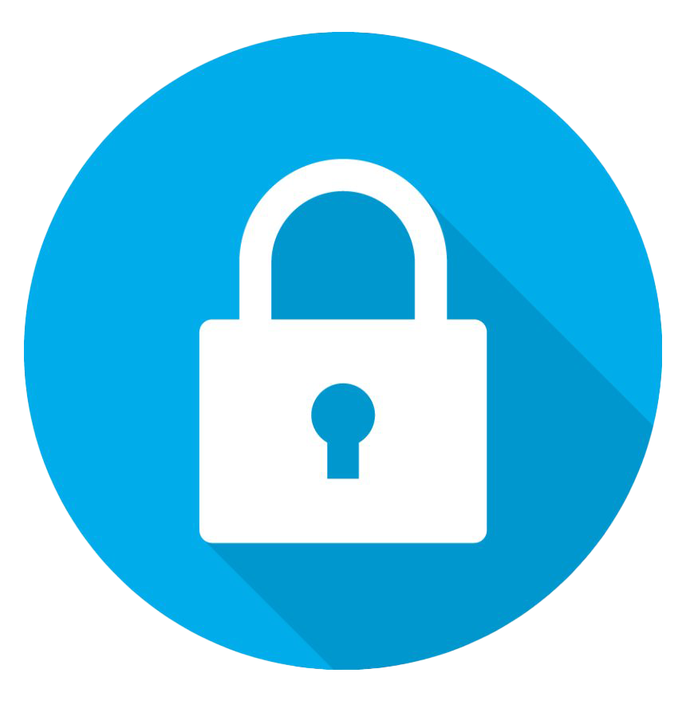
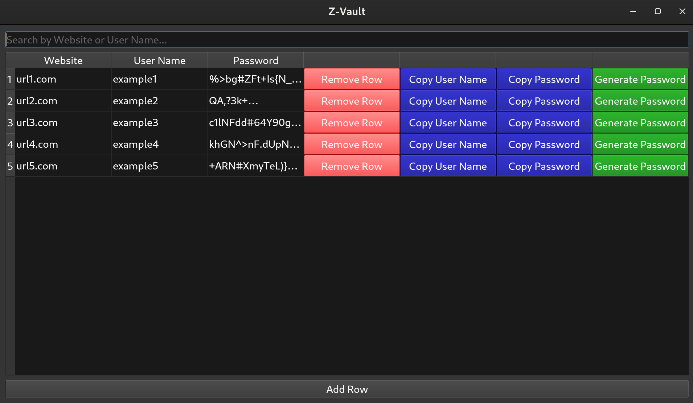

# Z-Vault

A simple password manager application built for personal use. This app allows you to securely store and retrieve passwords for various accounts. It is designed with a focus on simplicity, security, and ease of use.

<div align="center">
    
</div>


## Features

- **Secure password storage**: Uses advanced encryption to ensure that all passwords are stored securely.
- **Minimalistic design**: Easy-to-use interface.
- **Memory cleanup on exit**: Automatically clears all password data from memory when the program closes, eliminating any potential security risks from leftover data in RAM.

<div align="center">
    
</div>


## Security Features

- **Encryption Algorithms**: The application utilizes Crypto++'s AES algorithm with GCM mode to ensure confidentiality and authenticity of stored passwords.
- **Key Derivation**: Passwords are encrypted using keys derived from user passwords with PBKDF2 (Password-Based Key Derivation Function 2) and HMAC-SHA256, enhancing the security against brute-force attacks.
- **Secure Random Password Generation**: Includes a function to generate random passwords with high entropy, using Crypto++'s cryptographically secure random number generator.

## Compatibility

Z-Vault is designed to be cross-platform, with primary development on Linux using the X11 display server, which provides the optimal experience.

### Known Compatibility:

- **Linux**: 
  - **X11**: Fully supported and recommended.
  - **Wayland**: Supported and performs well, but some GUI elements may appear differently than intended. There are no current plans to address these graphical differences.

- **Windows & macOS**: The application should function with appropriate setups, but has not been extensively tested on these platforms.


## Requirements

- CMake 3.5 or higher
- Qt 5 (Widgets module)
- C++11 compatible compiler
- Crypto++ library

## Building the Project

To build the project, follow these steps:

1. **Clone the Repository**:
   ```bash
   git clone https://github.com/iman-zamani/Z-Vault.git
   cd Z-Vault
   ```

2. **Create a Build Directory**:
   ```bash
   mkdir build
   cd build
   ```

3. **Configure the Project with CMake**:
   ```bash
   cmake ..
   ```

4. **Build the Project**:
   ```bash
   cmake --build .
   ```

5. **Run the Application**:
   ```bash
   ./Z-Vault
   ```

## Installing Crypto++ Library

To ensure the application compiles and runs successfully, you need to install the Crypto++ library:

### On Linux:

Install Crypto++ using the package manager:

```bash
sudo apt-get install libcrypto++-dev
```

### On Windows:

Use `vcpkg` to install Crypto++ easily:

1. **Install vcpkg**:
   ```cmd
   git clone https://github.com/Microsoft/vcpkg.git
   cd vcpkg
   ./bootstrap-vcpkg.sh
   ./vcpkg.exe integrate install
   ```

2. **Install Crypto++**:
   ```cmd
   ./vcpkg install cryptopp:x64-windows
   ```

## Project Structure

- `main.cpp`: Entry point of the application.
- `mainwindow.cpp`: Contains the main window logic.
- `mainwindow.h`: Header file for the main window.
- `CMakeLists.txt`: Configuration file for CMake.

## License

This project is licensed under the MIT License. See the [LICENSE](LICENSE) file for more details.

## Contributing

Contributions are welcome! If you'd like to contribute, please fork the repository and submit a pull request.

## Contact

For any questions or feedback, please reach out to `izamanimoghaddam@gmail.com`.

